# Design Concepts

Three modern, mobile-first design themes have been implemented for calClories. Each lives on its own branch so you can preview and compare them independently.

---

## Design 1 — Dark Fitness 🌑
**Branch:** `copilot/dark-fitness`

Deep navy-black backgrounds, neon green accents, and glassmorphism effects create a premium workout-app aesthetic.

- Background: Deep navy-black `#080B14`
- Brand: Neon green `#00D97E`
- Header/Nav: Frosted glass via `backdrop-filter: blur`
- Ring: Neon glow via `filter: drop-shadow`

| Onboarding | Log | Progress | Settings |
|---|---|---|---|
| 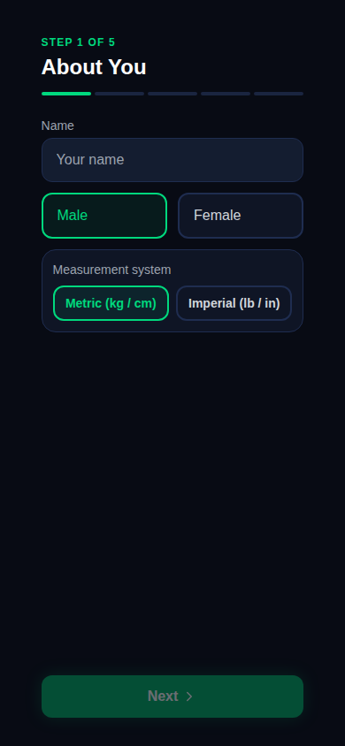 | 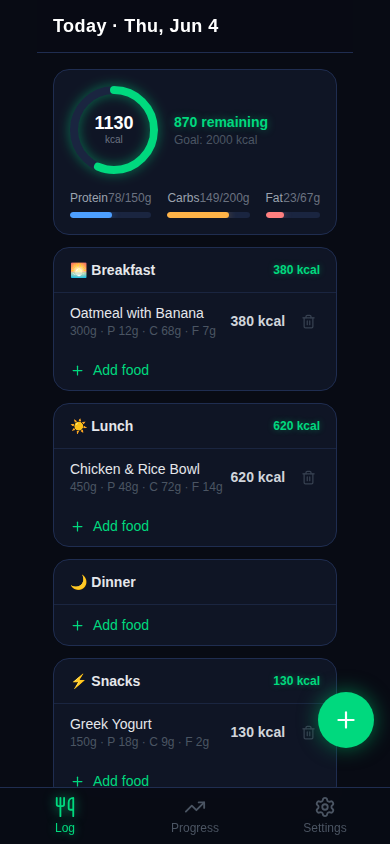 | 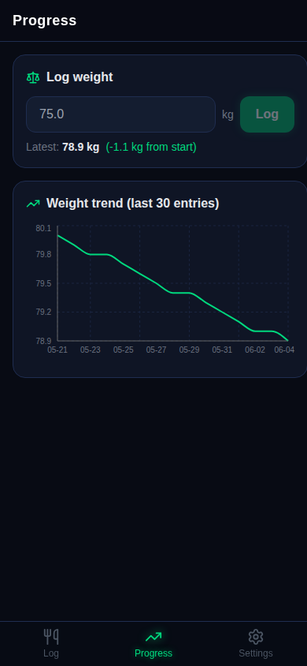 | 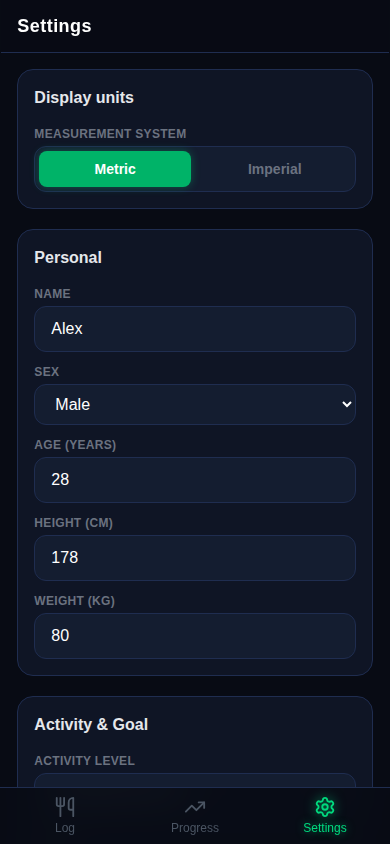 |

---

## Design 2 — Minimal Wellness 🌿
**Branch:** `copilot/minimal-wellness`

Warm cream tones, violet/purple accents, and generous rounded corners for a calm, spa-like wellness feel.

- Background: Warm cream `#fdfaf5`
- Brand: Violet `#7c3aed`
- Cards: Very rounded (`rounded-3xl`) with pastel slot headers
- Macro ring: Gradient fill

| Onboarding | Log | Progress | Settings |
|---|---|---|---|
| 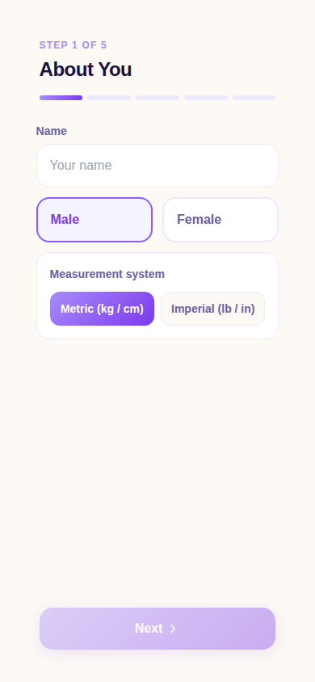 | 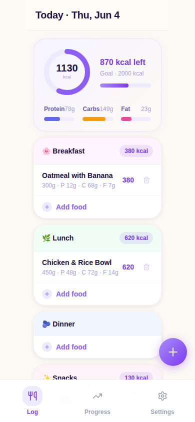 | 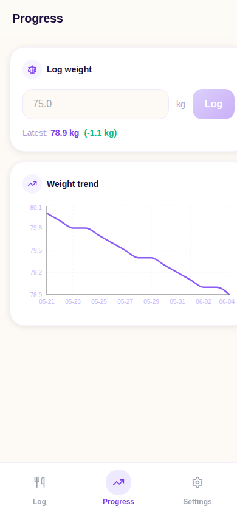 | 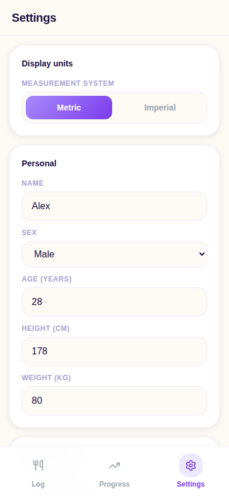 |

---

## Design 3 — Bold Energy ⚡
**Branch:** `copilot/bold-energy`

Light gray background, orange accents, and a brutalist card style with heavy black borders and offset shadows.

- Background: Light gray `#f8f9fa`
- Brand: Orange `#f97316`
- Cards: Brutalist `border: 2px solid #0f172a` + `box-shadow: 3px 3px 0px #0f172a`
- Typography: Heavy (`font-black`), uppercase labels

| Onboarding | Log | Progress | Settings |
|---|---|---|---|
| 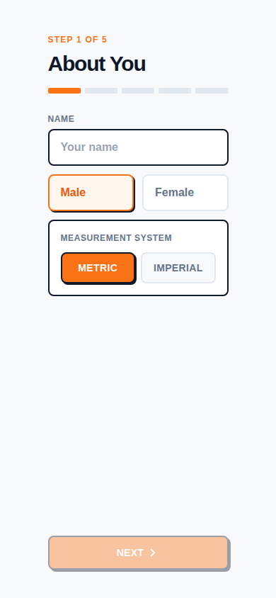 | 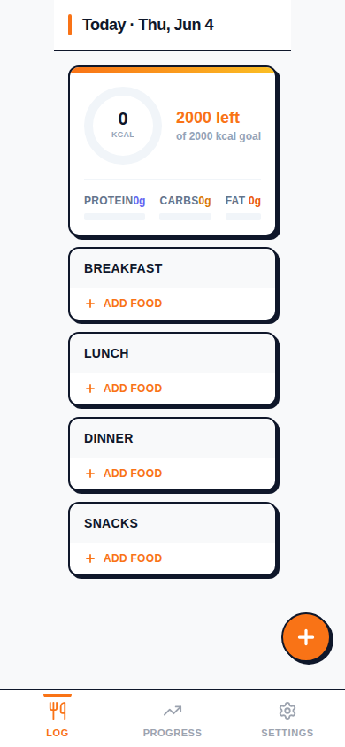 | 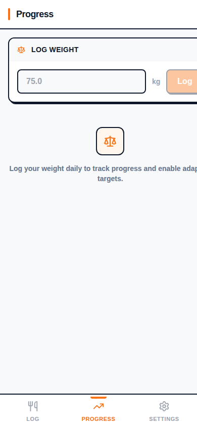 | 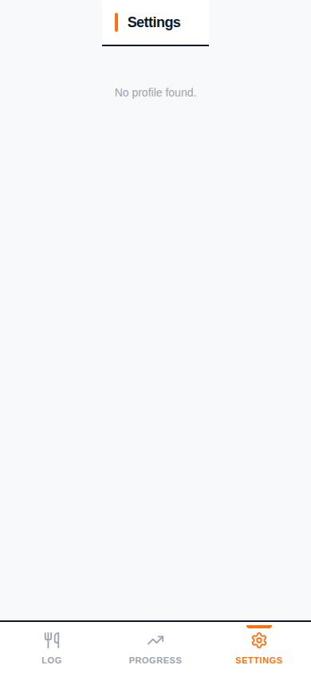 |
